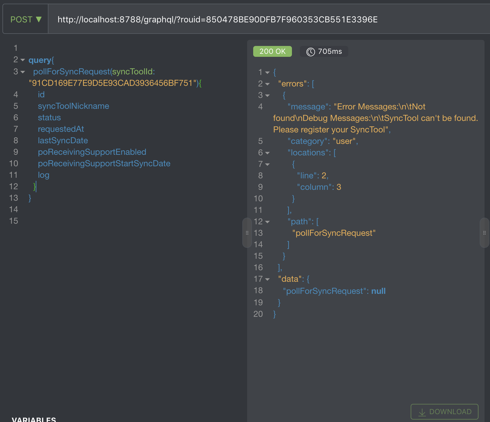
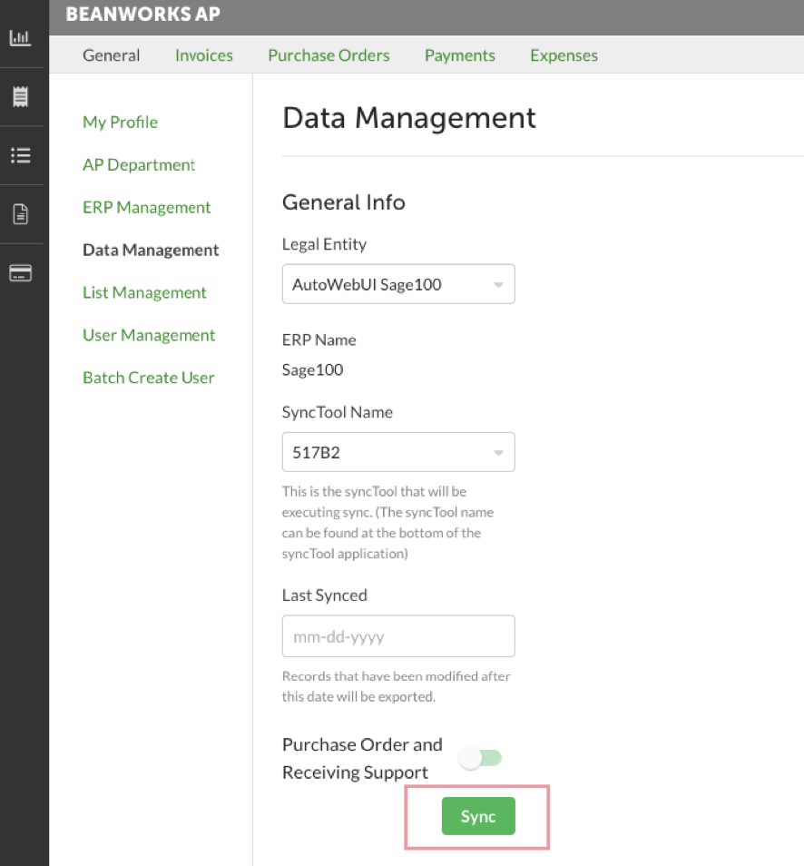

# GraphQL at Beanworks

---
## Agenda

### 1- Why?
### 2- What is GraphQL?
### 3- GraphQL at Beanworks
### 4- Implementing a Query

---
### Why this training session?

@ul[list-spaced-bullets]
- GraphQL is pretty **awesome**
- Not everyone's seen it
- Espresso & Remote Sync exclusively uses graphQL
@ulend

---
### What is GraphQL?

---
#### Query Language used for requesting data on a server

---
#### Only get what you asked for

You asked for 
```json zoom-18
query  {
  currentUser {
    visibleLegalEntities {
      display
    }
  }
}
```

---
You get 
```json zoom-18
{
  "data": {
    "currentUser": {
      "visibleLegalEntities": [
        {
          "display": "Alberta"
        },
        {
          "display": "Ontario"
        },
        {
          "display": "Quebec"
        },
        {
          "display": "British Columbia"
        }
      ]
    }
```

---
#### Many resources with one request thanks to references
You asked for 
```json zoom-18
query  {
  currentUser {
    visibleLegalEntities {
      display
    }
    permissions
  }
}
```

---
You get 
```json zoom-18
{
  "data": {
    "currentUser": {
      "visibleLegalEntities": [
        {
          "display": "Alberta"
        },
        {
          "display": "Ontario"
        },
        ...
      ],
      "permissions": [
        "approveAndReject",
        "archivesView",
        "batchApproveAndReject",
        "beanboardView",
        ...
      ]
    }
  }
}
```

---
#### Typed 🙏
```yaml zoom-18
fields:
  syncToolId:
    type: ID!
  legalEntityId:
    type: ID!
  lastSyncDate:
    type: DateTime
  poReceivingSupport:
    type: Boolean!
  poReceivingSyncStartDate:
    type: DateTime
```
 
---
#### GraphQL vs REST API

---
#### No more different endpoint!
@ul
- https://beandev.com/api/graphql/?rouid=D7946439EA2A068E5E9D06B6100DFA9A 
@ulend

---
#### Independent work for SyncTool, UI and API team

---
### Even errors in GraphQL has HTTP status code 200 ✅


---
### GraphQL at Beanworks

Beanworks uses a symfony bundle named *overblog/GraphQLBundle* that comes with
@ul
- GraphQL integration for PHP
- GraphQL Relay
@ulend

---
### Let's implement a mutation together!

---
### requestSyncLegalEntity Mutation


---
