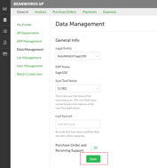

# GraphQL at Beanworks

---
## Agenda

### 1- Why?
### 2- What is GraphQL?
### 3- GraphQL at Beanworks
### 4- Implementing a Query

---
### Why this training session?

@ul[list-spaced-bullets]
- GraphQL is pretty **awesome**
- Not everyone's seen it
- Espresso & Remote Sync exclusively uses graphQL
@ulend

---
### What is GraphQL?

---
### Query Language used for requesting data on a server

---
### Only get what you asked for

You asked for 
```json zoom-18
query  {
  currentUser {
    visibleLegalEntities {
      display
    }
  }
}
```

---
You get 
```json zoom-18
{
  "data": {
    "currentUser": {
      "visibleLegalEntities": [
        {
          "display": "Alberta"
        },
        {
          "display": "Ontario"
        },
        {
          "display": "Quebec"
        },
        {
          "display": "British Columbia"
        },
        {
          "display": "Yukon"
        },
        {
          "display": "New Zealand"
        },
        {
          "display": "Manitoba"
        },
        {
          "display": "Alaska"
        },
        {
          "display": "New York"
        },
        {
          "display": "Florida"
        }
      ]
    }
```

---
- Many resources with one request thanks to references
- Typed 🙏
 
---
#### GraphQL vs REST API

@ul[list-spaced-bullets]
- No more different endpoint! 
- Independent work for SyncTool, UI and API team
- Even errors in GraphQL has HTTP status code 200 ✅
@ulend

---
### GraphQL at Beanworks

Beanworks uses a symfony bundle named *overblog/GraphQLBundle* that comes with
@ul
- GraphQL integration for PHP
- GraphQL Relay
@ulend

---
### Let's implement a mutation together!

---
### Syncs Query


---
